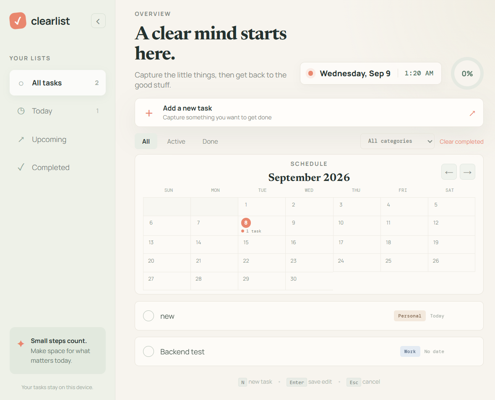

# Clearlist

Clearlist is a calm, browser-based task manager for capturing tasks, organizing them by category, and keeping track of what is due today or later. It runs without external dependencies and stores tasks locally in the browser. When started with the included Node.js server, it also syncs the task list to `data.json`.

## Features

- Create tasks with a name, category, and due date.
- Edit task details after creating them.
- Mark tasks as active or completed.
- Delete individual tasks.
- Clear all completed tasks at once.
- Browse separate views for all tasks, today's tasks, upcoming tasks, and completed tasks.
- Filter tasks by status: all, active, or completed.
- Filter tasks by category: personal, work, health, or learning.
- View a monthly calendar with task markers and navigate between months.
- See an overall completion percentage in the progress ring.
- View the current date and time in the dashboard header.
- Collapse the desktop sidebar and use a responsive layout on smaller screens.
- Use keyboard shortcuts: press `N` to create a task and `Esc` to close the task dialog.
- Keep a local browser copy of tasks using `localStorage`.
- Sync tasks with the included local JSON API when the app is served through Node.js.

## Getting started

### Requirements

- Node.js 18 or later is recommended.

### Run the app

1. Open a terminal in the project folder.
2. Start the server:

	 ```bash
	 npm start
	 ```

3. Open [http://localhost:5500](http://localhost:5500) in a browser.

The server uses port `5500` by default. Set the `PORT` environment variable to use another port:

```powershell
$env:PORT=3000; npm start
```

On macOS or Linux:

```bash
PORT=3000 npm start
```

## Data storage

When the app is opened through the Node.js server, tasks are loaded from `data.json` and saved back to that file through the `/api/tasks` endpoint. The browser also keeps a cached copy in `localStorage` under the key `clearlist.tasks`.

If the API is unavailable, Clearlist continues working with the locally cached browser data. Opening `index.html` directly is also possible, but changes will only be stored in that browser's `localStorage` because there is no server connection.

## Project structure

| File | Purpose |
| --- | --- |
| `index.html` | Application layout and task dialog markup |
| `styles.css` | Responsive visual design and animations |
| `app.js` | Task state, rendering, filters, calendar, and browser interactions |
| `server.js` | Static file server and `/api/tasks` JSON API |
| `data.json` | Server-side task data |
| `package.json` | Project metadata and start script |

## Preview



The screenshot above shows the main dashboard, including the task views, progress indicator, calendar, filters, and task list.